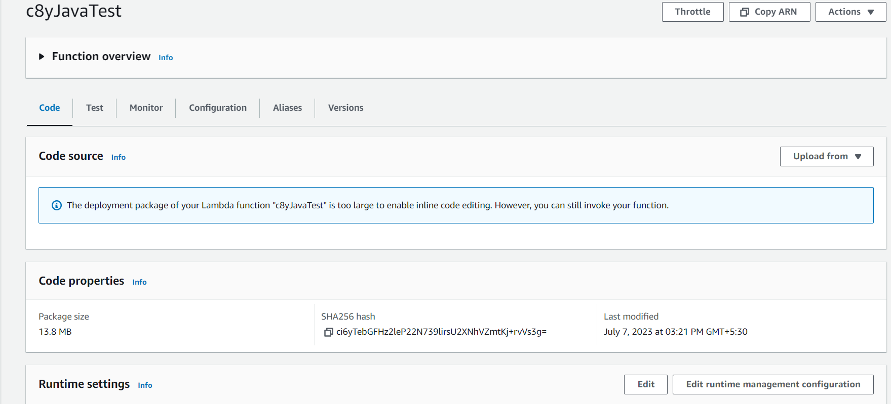
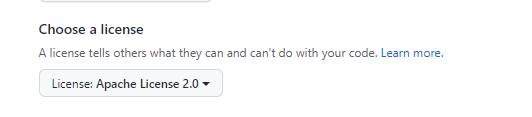

# AWS Lambda c8y

---

## Requirement

 - AWS Account with Lambda Service & S3 access
 - A Cumulocity IoT Tenant
 - JAVA 11
 - Maven 3.6
 - Cumulocity Microservice SDK
 - Cumulocity Credentials

## Build
 - Create an S3 bucket
 - CD to the Project Folder
 - Run the below command it will generate a JAR file
     maven clean package


## Deployment

* Upload the JAR file created in the above step into an S3 bucket
* Create an AWS Lambda function selecting runtime as Java 11 and other minimum required settings

* Upload the JAR into S3 bucket and copy the URL
* In the AWS Lambda function in code section select upload from S3 and past the link and save


Please make sure that you add a meaningful description to your repo.

## Logs


## Config

## Cumulocity Integration

### License
We strongly suggest that you use the [Apache 2.0 License](https://www.apache.org/licenses/LICENSE-2.0).
If you use this repo as a template the license will be automatically applied to your repo.

If you don't use this template you should select the Apache License on repo creation:



If you use open-source 3rd Party Software please check the [license compatibility](https://joinup.ec.europa.eu/collection/eupl/solution/joinup-licensing-assistant/jla-compatibility-checker) 

### Copyright Header

Each file that contains code from yourself should contain a copyright header in the following format:
````
Copyright (c) 2022 Software AG, Darmstadt, Germany and/or Software AG USA Inc., Reston, VA, USA,
and/or its subsidiaries and/or its affiliates and/or their licensors.

SPDX-License-Identifier: Apache-2.0

Licensed under the Apache License, Version 2.0 (the "License");
you may not use this file except in compliance with the License.
You may obtain a copy of the License at

     http://www.apache.org/licenses/LICENSE-2.0

Unless required by applicable law or agreed to in writing, software
distributed under the License is distributed on an "AS IS" BASIS,
WITHOUT WARRANTIES OR CONDITIONS OF ANY KIND, either express or implied.
See the License for the specific language governing permissions and
limitations under the License.

````


